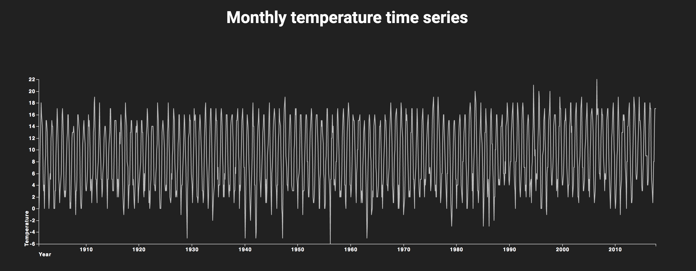

# ![Assessment 1][banner]

This is a D3 chart of visualsing the monthly temperature time series. This assignment is made with [D3](https://d3js.org/). I've chosen the [Line chart](https://bl.ocks.org/mbostock/3883245) to visualise my data. The data is from the [KMNI](https://www.knmi.nl/kennis-en-datacentrum/achtergrond/gehomogeniseerde-reeks-maandtemperaturen-de-bilt).



[Link to assessment](https://dylanvanzanten.github.io/fe3-assessment-1/)

## Background

First of I've copied the JS code from the original chart. When I copied the code I then went to analyse the code. After that I've downloaded the data and placed al the needing files inside my directory. I cleaned the original code up some bit. Some places where a bit messy, not indented etc. Here below I've picked out a example I've changed.

I've done this 
```
g = svg.append("g").attr("transform", "translate(" + margin.left + "," + margin.top + ")");
``` 

I've changed into:
```javascript
g = svg.append("g"),
    margin = 40,
    width = 1500,
    height = 500,
```

After that I've added a setAttribute for the svg. It contains the width and height and margins as a calculation for the svg.

I made a variable for the Y and X axis and gave them both a line where to place them. I explaind then which line the data is. The X-axis has the date (year) and the Y-axis has the temperature.

The next line is the connection to the temperature.csv data. In that line of code I added two parseTime. The parseTime comes from the parseTime = d3. It explains the date (Y/M/D).

After these functions I used the x and y.domain. The domain determines the amount of scale the chart has with the data.

After that I used the original g.append to edit the x and y-axis and the lines in the chart.

## Data

I used the data from the KMNI.

Download assessment-1/temperature.csv.

Format

Comma-separated values (CSV) with 1400 rows and two columns:

date — Date in YYYYMMDD
temp — Homogenised monthly temperature in degrees celsius

Example:

| date          | temp          |
| ------------- | ------------- |
| 19010131      | -0.424        | 
| 19010228      | -0.761        |
| 19010331      | 3.369         |
| 19010430      | 8.782         |
| 19010531      | 12.181        |

## Features

* [D3 scales](https://www.dashingd3js.com/d3js-scales)
* [D3](https://d3js.org/)
* [Original line chart](https://bl.ocks.org/mbostock/3883245)
* [KNMI](https://www.knmi.nl/kennis-en-datacentrum/achtergrond/gehomogeniseerde-reeks-maandtemperaturen-de-bilt)
* [Data KNMI](https://github.com/cmda-fe3/course-17-18/blob/master/assessment-1/temperature.csv)

## Thoughts
I'm very happy it worked. I still have some troubles with Javascript code. This trying to understand D3 and the code of it, but it's going wel!

## License

GPL 3.0 © 2017 Dylan van Zanten

[banner]: https://cdn.rawgit.com/cmda-fe3/logo/3b150735/banner-assessment-1.svg
